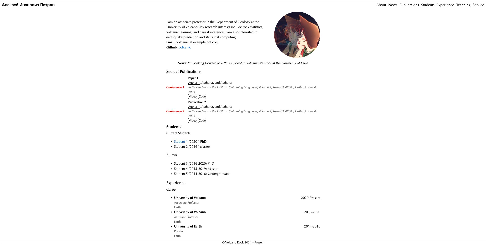

# HUGO ACADEMIC MIN

## Introduction

This theme is a simple academic CV theme designed for PhD students and professors. It allows you to easily display personal information, publications, services, courses, and research updates without needing to write any code. You can simply write in Markdown to achieve a clean appearance.

I created this theme because I prefer simple style compared to complex website built by a lot of JS code, I'm not a website builder.

This theme supports responsive layout, so it looks good on both desktop and mobile devices.

## Tutorial

Refer to the hugo.yaml file for the configuration. All of the content are configured in it.

## Screenshot

## Acknowledgement

This theme is derived from [hugo-xmin](https://github.com/yihui/hugo-xmin) made by [Yihui Xie](https://yihui.org).
